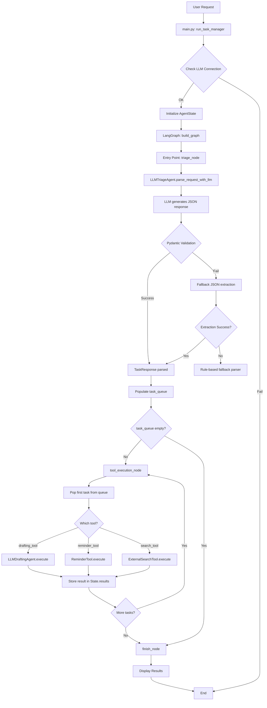

# Personal Task Manager Triage - Architecture & Data Flow V1

**Version:** 1.0
**Date:** 2025-12-16
**Status:** Production

---

## Table of Contents

1. [System Overview](#system-overview)
2. [Architectural Layers](#architectural-layers)
3. [Data Flow](#data-flow)
4. [Component Details](#component-details)
5. [State Management](#state-management)
6. [LLM Integration](#llm-integration)
7. [Persistence Strategy](#persistence-strategy)
8. [Design Patterns](#design-patterns)

---

## System Overview

**Personal Task Manager Triage** is a multi-agent LLM-powered CLI application that autonomously analyzes complex user requests, breaks them into discrete tasks, and routes them to specialized agents for execution.

### Core Technologies

- **LangGraph**: Stateful workflow orchestration
- **Pydantic**: Structured output validation and JSON parsing
- **LLM Providers**: Pluggable support for Ollama (local) and GPT-5-Mini (OpenAI)
- **Rich**: Beautiful CLI interface with panels, tables, and trees
- **SQLite**: State persistence via LangGraph checkpointer

### Key Characteristics

- **ReAct Pattern**: Reasoning + Acting in agent decision-making
- **LLM-Driven**: Task analysis and email drafting powered by LLMs
- **Stateful Execution**: Persistent state across sessions
- **Multi-Agent**: Specialized agents for different task types
- **Pluggable Architecture**: Easy to swap LLM providers

---

# The three main nodes of the langraph architecture

[crash course from gemini](https://gemini.google.com/app/e3d101faee6ca3d3)

In `main.py`, the three nodes are:

### 1. **Agent Node** (Triage Node)
- **Location**: `main.py`, lines **59-94**
- **Function**: `triage_node(state: AgentState)`
- **Purpose**: Uses `LLMTriageAgent` to analyze the user request and populate the task queue
- **Registered in graph**: Line 198 as `"triage"`

### 2. **Tool Node** (Tool Execution Node)
- **Location**: `main.py`, lines **96-138**
- **Function**: `tool_execution_node(state: AgentState)`
- **Purpose**: Executes tools from the task queue (reminder, drafting, search)
- **Registered in graph**: Line 199 as `"tool_execution"`

### 3. **Final Response Node** (Finish Node)
- **Location**: `main.py`, lines **140-146**
- **Function**: `finish_node(state: AgentState)`
- **Purpose**: Final compilation and summary generation
- **Registered in graph**: Line 200 as `"finish"`

All three are defined in the **"GRAPH NODES"** section (lines 56-146) and registered in `build_graph()` (lines 192-231). The graph structure is:

```
START → triage → [conditional] → tool_execution → [conditional] → finish → END
```

The final summary display happens after the graph execution completes, in `run_task_manager()` at lines 422-425, where `display_execution_tree()` and `display_summary()` are called.


---

# Where the Thinking happens

The "thinking" part is in the Triage Agent, where the LLM analyzes the request and generates reasoning.

## Primary Thinking Location

The thinking happens in `agents/llm_triage_agent.py`, specifically in the `parse_request_with_llm()` method:

```66:118:agents/llm_triage_agent.py
@lru_cache(maxsize=100)
def parse_request_with_llm(self, request: str) -> ParseResult:
    """Use LLM to parse request into discrete tasks and return tasks plus reasoning
    ...
    """
    # ... prompt construction (lines 90-106) ...
    
    response = self.llm.generate(prompt, temperature=0.3)  # Line 110 - THE THINKING HAPPENS HERE
    
    # Parse response to extract reasoning
    parsed = TaskResponse.model_validate_json(response)
    tasks = [{"tool": task.tool, "content": task.content} for task in parsed.tasks]
    return tasks, parsed.reasoning  # Returns the LLM's reasoning
```

The thinking process:
1. Prompt construction (lines 90-106): Builds a prompt asking the LLM to analyze the request
2. LLM call (line 110): `self.llm.generate(prompt, temperature=0.3)` — the LLM analyzes and reasons
3. Reasoning extraction: The LLM response includes a `reasoning` field explaining why it identified certain tasks
4. Storage: The reasoning is stored in `state["llm_reasoning"]` in the triage node (line 74 of `main.py`)
5. Display: The reasoning is shown to the user in a panel (lines 78-82 of `main.py`)

## Secondary Thinking

The drafting agent also uses the LLM to generate email content (in `tools/drafting_tool.py`, line 31), but it doesn't return explicit reasoning—it generates the email body directly.

The main "thinking" is the triage agent's reasoning step, which follows the ReAct pattern: the agent reasons about what tasks to perform before acting (executing tools).

## Architectural Layers

The system is organized into 5 distinct layers:

```
┌─────────────────────────────────────────────────┐
│              Layer 1: CLI Interface             │
│         (main.py - Rich console output)         │
└─────────────────────────────────────────────────┘
                        ↓
┌─────────────────────────────────────────────────┐
│         Layer 2: LangGraph Workflow Engine      │
│    (StateGraph, Nodes, Conditional Routing)     │
└─────────────────────────────────────────────────┘
                        ↓
┌─────────────────────────────────────────────────┐
│           Layer 3: Agent Orchestration          │
│      (Triage Agent, Worker Agents, Tools)       │
└─────────────────────────────────────────────────┘
                        ↓
┌─────────────────────────────────────────────────┐
│          Layer 4: LLM Provider Abstraction      │
│       (Factory, Base, Ollama/GPT Clients)       │
└─────────────────────────────────────────────────┘
                        ↓
┌─────────────────────────────────────────────────┐
│            Layer 5: Persistence Layer           │
│    (SQLite Checkpointer, File-based outputs)    │
└─────────────────────────────────────────────────┘
```

### Layer Responsibilities

| Layer | Component | Responsibility |
|-------|-----------|---------------|
| **1. CLI Interface** | `main.py` | User interaction, input/output, display formatting |
| **2. Workflow Engine** | LangGraph StateGraph | State management, node execution, routing logic |
| **3. Agent Orchestration** | Triage/Worker Agents | Task analysis, tool selection, task execution |
| **4. LLM Abstraction** | Factory + Clients | Unified LLM interface, provider switching |
| **5. Persistence** | SqliteSaver + Files | State checkpointing, output storage |

---

## Data Flow

### High-Level Flow

```
User Input (CLI)
    ↓
[1] Triage Node
    - LLMTriageAgent analyzes request
    - Returns List[Task] + reasoning
    - Validates with Pydantic
    ↓
[2] Task Queue Population
    - State.task_queue = [{"tool": "X", "content": "Y"}, ...]
    - State.llm_reasoning = ["Analysis..."]
    ↓
[3] Tool Execution Loop
    - Pop task from queue
    - Route to appropriate tool/agent
    - Store result in State.results
    - Repeat until queue empty
    ↓
[4] Finish Node
    - Compile results
    - Display summary
    ↓
Output (CLI + Files)
```

### Detailed Request Processing Flow



### State Transitions

The `AgentState` object flows through nodes and accumulates data:

```python
# Initial State (Iteration 0)
{
    "user_request": "Remind me to call John, draft email, search for weather",
    "task_queue": [],
    "results": {},
    "current_task": {},
    "iteration": 0,
    "agent_thoughts": [],
    "llm_reasoning": []
}

# After Triage Node (Iteration 1)
{
    "user_request": "...",
    "task_queue": [
        {"tool": "reminder_tool", "content": "call John"},
        {"tool": "drafting_tool", "content": "..."},
        {"tool": "search_tool", "content": "weather"}
    ],
    "results": {},
    "iteration": 1,
    "agent_thoughts": ["Identified 3 tasks using LLM analysis"],
    "llm_reasoning": ["Triage: User wants to set reminder, draft email, search data"]
}

# After First Tool Execution (Iteration 2)
{
    "task_queue": [
        {"tool": "drafting_tool", "content": "..."},
        {"tool": "search_tool", "content": "weather"}
    ],
    "results": {
        "reminder_tool_1": "✓ Reminder saved to inbox/reminders/..."
    },
    "iteration": 2,
    "agent_thoughts": [
        "Identified 3 tasks using LLM analysis",
        "Executed reminder_tool: call John"
    ],
    ...
}

# Final State (All tasks complete)
{
    "task_queue": [],
    "results": {
        "reminder_tool_1": "✓ Reminder saved...",
        "drafting_tool_2": "✓ Email draft saved...",
        "search_tool_3": "✓ Found data..."
    },
    "iteration": 4,
    ...
}
```

---

## Component Details

### 1. Triage Agent (`agents/llm_triage_agent.py`)

**Purpose**: Analyzes user requests and decomposes them into discrete tasks

**Key Methods**:
- `parse_request_with_llm(request: str) -> (TaskList, str)`
  - Sends request to LLM with structured prompt
  - Validates response with Pydantic (`TaskResponse` model)
  - Falls back to JSON extraction or rule-based parsing if needed
  - Returns list of tasks + reasoning

**Pydantic Models**:
```python
class TaskItem(BaseModel):
    tool: str  # "reminder_tool", "drafting_tool", "search_tool"
    content: str  # Task description

class TaskResponse(BaseModel):
    tasks: List[TaskItem]
    reasoning: str
```

**Parsing Strategy (3 levels)**:
1. **Primary**: Pydantic validation (`TaskResponse.model_validate_json()`)
2. **Fallback 1**: JSON extraction via brace matching + Pydantic re-validation
3. **Fallback 2**: Rule-based regex parsing (detects keywords like "remind", "draft", "search")

**Caching**: Uses `@lru_cache(maxsize=100)` for request caching

### 2. Worker Agents & Tools

#### ReminderTool (`tools/reminder_tool.py`)
- **Purpose**: Creates timestamped reminder files
- **Output**: `inbox/reminders/reminder_TIMESTAMP_content.txt`
- **Execution**: Synchronous, file-based

#### DraftingTool + LLMDraftingAgent
- **DraftingTool** (`tools/drafting_tool.py`): File creation logic
- **LLMDraftingAgent** (`agents/llm_drafting_agent.py`): LLM-powered email generation
- **Flow**:
  1. Agent receives content (e.g., "quarterly report")
  2. Generates prompt for LLM: "Write professional email about: quarterly report"
  3. LLM generates email body (temperature=0.7 for creativity)
  4. Tool saves formatted email to `inbox/drafts/draft_TIMESTAMP_content.txt`

#### ExternalSearchTool (`tools/external_search_tool.py`)
- **Purpose**: Simulates data lookup (placeholder for API integration)
- **Current**: Returns mock data
- **Future**: Can integrate real APIs (Google Search, stock data, etc.)

### 3. LangGraph Workflow (`main.py`)

**Nodes**:

| Node | Function | Responsibility |
|------|----------|---------------|
| `triage_node` | `triage_node(state)` | Calls LLMTriageAgent, populates task_queue, displays reasoning |
| `tool_execution_node` | `tool_execution_node(state)` | Pops task, executes tool, stores result, increments iteration |
| `finish_node` | `finish_node(state)` | Final compilation and summary display |

**Conditional Routing**:

```python
# After triage: Has tasks?  Execute : Finish
def route_after_triage(state):
    return "tool_execution" if state["task_queue"] else "finish"

# After tool execution: More tasks?  Loop back : Finish
def route_after_tool(state):
    return "triage" if state["task_queue"] else "finish"
```

**Graph Structure**:
```
START  triage  [tasks?]  tool_execution  [more tasks?] 
                                                           
                  finish                      
                                                            
                    END                                      
                                                            
                                        
```

### 4. LLM Provider Abstraction

**Strategy Pattern Implementation**:

```
LLMClientBase (ABC)
     generate(prompt, temperature)  str
    
     OllamaClient (agents/ollama_client.py)
        Uses requests to call http://localhost:11434/api/generate
    
     GPTClient (agents/gpt_client.py)
         Uses OpenAI SDK to call OpenAI API
```

**LLMFactory** (`agents/llm_factory.py`):
- `create_llm_client(client_type: str, **kwargs)  LLMClientBase`
- `get_llm_client_from_env()  LLMClientBase`
  - Reads `LLM_PROVIDER` env var (defaults to "ollama")
  - Returns appropriate client instance

**Environment Configuration**:
```bash
# Use Ollama (default)
LLM_PROVIDER=ollama

# Use GPT
LLM_PROVIDER=gpt
OPENAI_API_KEY=sk-...
```

---

## State Management

### AgentState Schema

```python
class AgentState(TypedDict):
    user_request: str              # Original user input
    task_queue: List[Dict[str, str]]  # [{"tool": "X", "content": "Y"}]
    results: Dict[str, str]        # {"tool_name_iteration": "result"}
    current_task: Dict[str, str]   # Currently executing task
    iteration: int                 # Loop counter (starts at 0)
    agent_thoughts: List[str]      # Execution log
    llm_reasoning: List[str]       # LLM reasoning traces
```

### State Persistence (LangGraph Checkpointer)

**Implementation**: `SqliteSaver` from LangGraph

**Location**: `data/checkpoints.db`

**How it Works**:
1. `get_checkpointer()` initializes SQLite connection
2. LangGraph automatically saves state after each node execution
3. Thread ID (`thread_id`) used to track conversation sessions
4. State can be resumed by providing same `thread_id`

**Usage Example**:
```python
# New session
thread_id = str(uuid.uuid4())
graph.invoke(state, config={"configurable": {"thread_id": thread_id}})

# Resume session
graph.invoke(state, config={"configurable": {"thread_id": existing_thread_id}})
```

**Benefits**:
- Automatic crash recovery
- Session history tracking
- Enables multi-turn conversations
- No manual state serialization needed

---

## LLM Integration

### Request Flow to LLM

```
Agent (Triage/Drafting)
    
LLMFactory.get_llm_client_from_env()
    
LLMClientBase.generate(prompt, temperature)
    
[Ollama: HTTP POST to localhost:11434]
[GPT: OpenAI API call via SDK]
    
Raw LLM Response (text/JSON)
    
[Triage: Pydantic validation  TaskResponse]
[Drafting: Raw text  Email body]
    
Processed Output
```

### Prompt Engineering

**Triage Agent Prompt Structure**:
```
You are a task analysis expert. Analyze the following user request...

User Request: "{request}"

Available Tools:
- reminder_tool: Sets a reminder...
- drafting_tool: Drafts an email...
- search_tool: Searches for data...

Respond with JSON in this exact format:
{
  "tasks": [
    {"tool": "reminder_tool", "content": "..."},
    ...
  ],
  "reasoning": "..."
}
```

**Drafting Agent Prompt Structure**:
```
Write a professional email about: {content}

Generate ONLY the email body (no subject, no greeting, no signature).
Keep it concise and professional, maximum 3-4 sentences.

Email body:
```

### Temperature Settings

| Agent | Temperature | Rationale |
|-------|------------|-----------|
| Triage Agent | 0.3 | Consistency in task identification |
| Drafting Agent | 0.7 | Creativity in email composition |

---

## Persistence Strategy

### State Persistence (LangGraph Checkpointer)

- **Mechanism**: SQLite database via `SqliteSaver`
- **Location**: `data/checkpoints.db`
- **Scope**: Entire `AgentState` object
- **Granularity**: After each node execution
- **Access**: Via `thread_id` in graph invocation config

### Output Persistence (File System)

#### Reminders
- **Directory**: `inbox/reminders/`
- **Format**: `reminder_YYYYMMDD_HHMMSS_content.txt`
- **Content**: `[timestamp] REMINDER: {content}`

#### Email Drafts
- **Directory**: `inbox/drafts/`
- **Format**: `draft_YYYYMMDD_HHMMSS_content.txt`
- **Content**: Formatted email with subject, body, signature

#### Search Results
- **Directory**: Not persisted (returned inline)
- **Future**: Could save to `inbox/searches/`

---

## Design Patterns

### 1. Strategy Pattern (LLM Providers)

**Intent**: Define a family of algorithms (LLM clients), encapsulate each one, and make them interchangeable.

**Implementation**:
- **Strategy Interface**: `LLMClientBase` (abstract `generate()` method)
- **Concrete Strategies**: `OllamaClient`, `GPTClient`
- **Context**: `LLMTriageAgent`, `LLMDraftingAgent` (use `LLMClientBase`)
- **Factory**: `LLMFactory` (creates appropriate strategy)

**Benefits**:
- Easy to add new LLM providers (Claude, Gemini, etc.)
- No code changes in agents when switching providers
- Testable (can inject mock LLM clients)

### 2. Factory Pattern (LLM Client Creation)

**Intent**: Define an interface for creating objects, but let subclasses decide which class to instantiate.

**Implementation**:
```python
class LLMFactory:
    @staticmethod
    def create_llm_client(client_type: str, **kwargs):
        if client_type == "ollama":
            return OllamaClient()
        elif client_type == "gpt":
            return GPTClient(api_key=kwargs["api_key"])
        ...
```

### 3. ReAct Pattern (Reasoning + Acting)

**Intent**: Combine reasoning (LLM analysis) with acting (tool execution).

**Implementation**:
- **Reasoning**: LLMTriageAgent analyzes request, explains why tasks were identified
- **Acting**: Tool execution based on reasoning
- **Observation**: Results stored, fed back to system
- **Reflection**: `llm_reasoning` and `agent_thoughts` track decision-making

**Flow**:
```
Request  [Reason]  Tasks  [Act]  Results  [Observe]  State Update
```

### 4. State Machine Pattern (LangGraph Workflow)

**Intent**: Allow an object to alter its behavior when its internal state changes.

**Implementation**:
- **States**: `triage`, `tool_execution`, `finish`
- **Transitions**: Conditional edges based on `task_queue` state
- **State Context**: `AgentState` TypedDict

**State Diagram**:
```
[START]  triage  tool_execution   finish  [END]
```

### 5. Template Method Pattern (Tool Execution)

**Intent**: Define the skeleton of an algorithm, letting subclasses override specific steps.

**Implementation**:
```python
# Template in tool_execution_node
def tool_execution_node(state):
    task = get_next_task(state)        # Step 1
    tool = select_tool(task)            # Step 2
    result = execute_tool(tool, task)   # Step 3 (varies by tool)
    update_state(state, result)         # Step 4
    return state
```

### 6. Repository Pattern (Tool Registry)

**Intent**: Encapsulate the logic required to access data sources.

**Implementation**:
```python
AVAILABLE_TOOLS = {
    "reminder_tool": ReminderTool,
    "drafting_tool": DraftingTool,
    "search_tool": ExternalSearchTool
}

# Access via registry
tool_class = AVAILABLE_TOOLS.get(tool_name)
```

**Benefits**:
- Centralized tool management
- Easy to add new tools
- Decouples tool selection from execution logic

---

## Key Architectural Decisions

### 1. Why Pydantic for JSON Parsing?

**Problem**: LLM responses are unpredictable; manual JSON parsing is brittle and verbose.

**Solution**: Pydantic provides:
- Automatic validation and type coercion
- Clear error messages
- Reduced code (150 lines  35 lines in triage agent)
- Self-documenting schemas

**Trade-off**: Adds dependency, but worth it for reliability and maintainability.

### 2. Why LangGraph for Workflow?

**Problem**: Need stateful, multi-step workflow with conditional routing and persistence.

**Solution**: LangGraph provides:
- Built-in state management (`AgentState`)
- Conditional routing between nodes
- Automatic state persistence (checkpointing)
- Clear, declarative workflow definition

**Trade-off**: Learning curve, but avoids reinventing state machines.

### 3. Why Strategy Pattern for LLM Providers?

**Problem**: Need to support multiple LLM providers without code duplication.

**Solution**: Strategy pattern + factory allows:
- Plug-and-play LLM providers
- Easy testing (mock LLM clients)
- Environment-based provider selection

**Trade-off**: Additional abstraction layer, but essential for flexibility.

### 4. Why File-Based Output Persistence?

**Problem**: Need to save reminders and drafts for user access.

**Solution**: Simple file system storage:
- Easy to inspect (plain text files)
- No database overhead for simple outputs
- Familiar to users (standard file locations)

**Trade-off**: Not queryable like a database, but sufficient for current use case.

### 5. Why Temperature 0.3 for Triage, 0.7 for Drafting?

**Problem**: Need consistency in task analysis, creativity in email composition.

**Solution**:
- **Triage (0.3)**: Low temperature  more deterministic, consistent task identification
- **Drafting (0.7)**: Higher temperature  more varied, natural email writing

**Trade-off**: Tuned empirically, may need adjustment per LLM provider.

---

## Extension Points

### Adding a New Tool

1. **Create tool class** in `tools/new_tool.py`:
   ```python
   class NewTool:
       name = "new_tool"
       description = "What this tool does"

       @staticmethod
       def execute(content: str) -> str:
           return "result"
   ```

2. **Register in `AVAILABLE_TOOLS`** (`agents/llm_triage_agent.py`):
   ```python
   AVAILABLE_TOOLS = {
       "new_tool": NewTool,
       ...
   }
   ```

3. **Update tool execution** in `main.py` (if needs special handling like LLM):
   ```python
   if tool_name == "new_tool":
       result = SpecialAgent().execute(content)
   else:
       result = tool_class.execute(content)
   ```

### Adding a New LLM Provider

1. **Implement client** in `agents/new_provider_client.py`:
   ```python
   class NewProviderClient(LLMClientBase):
       def generate(self, prompt, temperature=0.3) -> str:
           # Call new provider API
           return response
   ```

2. **Update factory** (`agents/llm_factory.py`):
   ```python
   def create_llm_client(client_type: str, **kwargs):
       if client_type == "new_provider":
           return NewProviderClient(**kwargs)
       ...
   ```

3. **Configure environment**:
   ```bash
   LLM_PROVIDER=new_provider
   NEW_PROVIDER_API_KEY=...
   ```

### Adding State Persistence Fields

1. **Update `AgentState`** in `main.py`:
   ```python
   class AgentState(TypedDict):
       ...
       new_field: str
   ```

2. **LangGraph checkpointer automatically persists new fields** (no code changes needed).

### Adding Multi-Turn Conversation Support

1. **Persist `thread_id`** between user interactions
2. **Pass same `thread_id`** to `run_task_manager()`
3. **Access conversation history** from checkpointed state
4. **Modify triage prompt** to include conversation context

---

## Performance Considerations

### Caching

- **Triage Agent**: Uses `@lru_cache(maxsize=100)` on `parse_request_with_llm()`
  - Avoids redundant LLM calls for identical requests
  - Clears automatically when cache is full (LRU eviction)

### Tool Descriptions

- **Pre-built cache**: `_build_tool_cache()` runs once at initialization
  - Avoids string concatenation on every LLM call
  - Stored in `self._tool_cache`

### Async Considerations

- **Current**: Synchronous execution (sequential tool execution)
- **Future**: LangGraph supports async nodes for parallel tool execution
  - Example: Execute reminder, draft, and search in parallel

### Database Connections

- **Checkpointer**: Uses persistent SQLite connection (`check_same_thread=False`)
- **Location**: `data/checkpoints.db` (keeps project root clean)

---

## Error Handling

### LLM Response Parsing

**3-Level Fallback Strategy**:

1. **Pydantic Validation** (`TaskResponse.model_validate_json()`)
   - Primary method
   - Handles well-formed JSON responses
   - Raises `ValidationError` on malformed JSON

2. **Fallback JSON Extraction** (`_fallback_extract_json()`)
   - Triggered on Pydantic failure
   - Uses brace matching to extract JSON substring
   - Re-validates with Pydantic
   - Logs warning if successful (indicates LLM added extra text)

3. **Rule-Based Fallback** (`_fallback_parse()`)
   - Last resort when JSON extraction fails
   - Uses regex to detect keywords ("remind", "draft", "search")
   - Returns best-guess tasks based on patterns
   - Always returns at least one task (generic search if nothing matches)

### LLM Connection Errors

**Check on Startup** (`check_llm_connection()`):
- **Ollama**: Pings `/api/tags` endpoint, verifies model availability
- **GPT**: Checks `OPENAI_API_KEY` environment variable
- **Failure**: Exits with clear error message and setup instructions

**During Execution**:
- Wrapped in try-except in `parse_request_with_llm()`
- Falls back to rule-based parsing on LLM failure
- Logs errors for debugging

### File I/O Errors

**Tool Execution**:
- Tools use `os.makedirs(..., exist_ok=True)` to ensure directories exist
- Wrapped in try-except, returns error message on failure
- Example: `" Failed to set reminder: Permission denied"`

---

## Testing Strategy

### Current Testing Approach

**Interactive Testing**:
- Run `uv run main.py` with example requests
- Verify:
  1. Pydantic parsing succeeds (no fallback warnings in logs)
  2. Correct number of tasks identified
  3. Tasks routed to appropriate tools
  4. Files created in `inbox/reminders/` and `inbox/drafts/`

**Provider Switching**:
- Test with both Ollama and GPT providers
- Verify identical behavior across providers

### Recommended Unit Tests (Future)

1. **Triage Agent**:
   - Test Pydantic parsing with valid JSON
   - Test fallback extraction with malformed JSON
   - Test rule-based parsing with keyword requests
   - Test empty/invalid requests

2. **Tools**:
   - Test file creation
   - Test filename sanitization
   - Test error handling (permission errors, disk full)

3. **LLM Clients**:
   - Mock LLM responses
   - Test connection errors
   - Test timeout handling

4. **LangGraph Workflow**:
   - Test state transitions
   - Test conditional routing
   - Test checkpointing/resumption

---

## Security Considerations

### LLM Prompt Injection

**Risk**: User input directly embedded in prompts could manipulate LLM behavior.

**Mitigations**:
- Structured output (Pydantic) limits attack surface
- Tool registry restricts available actions
- No code execution based on LLM output (only predefined tool methods)

**Future**: Add input sanitization for user requests.

### File System Access

**Risk**: Unsanitized filenames could lead to path traversal attacks.

**Mitigations**:
- Filename sanitization: `re.sub(r'[^\w\s-]', '', content[:30])`
- Fixed output directories (`inbox/reminders/`, `inbox/drafts/`)
- No user-controlled file paths

### API Key Exposure

**Risk**: API keys could be logged or exposed in error messages.

**Mitigations**:
- API keys loaded from environment variables (`.env`)
- No API keys in code or version control
- `.gitignore` includes `.env`

**Best Practice**: Use `.env.example` as template, never commit real keys.

### State Persistence

**Risk**: Sensitive user requests stored in SQLite database.

**Mitigations**:
- Database stored in `data/` directory (add to `.gitignore` if needed)
- No encryption (assumes local-only usage)

**Future**: Add encryption for sensitive data if multi-user or cloud deployment planned.

---

## Monitoring & Debugging

### Logging

**Current Logging**:
- Module: `logging.basicConfig(level=logging.INFO)`
- Key logs:
  - `LLMTriageAgent`: Request processing, parsing success/failure
  - `LLMFactory`: Client creation
  - Fallback activations (warnings)

**Log Locations**:
- Console output (CLI)
- No file logging (add with `logging.FileHandler` if needed)

### Debugging Workflow

1. **Check LLM Connection**:
   - Look for " Connected to Ollama" or " GPT client configured"
   - Verify model availability

2. **Inspect Triage Output**:
   - Console displays "LLM Reasoning" panel
   - Shows identified tasks before execution

3. **Verify Tool Execution**:
   - Each tool execution shows status in console
   - Check `inbox/` directories for output files

4. **Review State**:
   - `display_summary()` shows full execution log
   - `agent_thoughts` tracks each step
   - `llm_reasoning` shows LLM decision-making

5. **Check Logs for Fallbacks**:
   - `"Pydantic parsing failed"`  LLM returned malformed JSON
   - `"Fallback parser generated"`  LLM failed completely

---

## Future Enhancements

### Short-Term (Next 3 Months)

1. **Async Tool Execution**: Parallel execution for independent tasks
2. **Enhanced Search Tool**: Real API integration (Google, Bing, etc.)
3. **Unit Test Suite**: Comprehensive coverage of core components
4. **Error Recovery**: Retry logic for transient LLM failures

### Medium-Term (3-6 Months)

1. **Multi-Turn Conversations**: Support for follow-up questions and clarifications
2. **Context Awareness**: Use conversation history in triage decisions
3. **Custom Tool Creation**: User-defined tools via configuration
4. **Rich Notifications**: Desktop notifications for completed tasks

### Long-Term (6+ Months)

1. **Web Interface**: GUI alternative to CLI
2. **Cloud Deployment**: Multi-user support with authentication
3. **Tool Marketplace**: Community-contributed tools
4. **Advanced Agents**: Self-improving agents via reinforcement learning
5. **Integration Hub**: Connect to external services (Calendar, Email, Slack, etc.)

---

## Appendix: File Structure

```
personal-triage-agent/
 main.py                          # CLI entry point, LangGraph workflow
 pyproject.toml                   # Dependencies, project config
 .env                             # Environment variables (not in git)
 .env.example                     # Template for environment setup

 agents/
    llm_triage_agent.py          # Main triage agent (ReAct pattern)
    llm_drafting_agent.py        # Email drafting agent
    llm_client_base.py           # Abstract LLM client interface
    llm_factory.py               # Factory for LLM client creation
    ollama_client.py             # Ollama implementation
    gpt_client.py                # GPT implementation

 tools/
    reminder_tool.py             # Reminder creation tool
    drafting_tool.py             # Email drafting tool
    external_search_tool.py      # Data search tool

 data/
    checkpoints.db               # LangGraph state persistence

 inbox/
    reminders/                   # Generated reminders
       reminder_TIMESTAMP_*.txt
    drafts/                      # Generated email drafts
        draft_TIMESTAMP_*.txt

 docs/                            # Learning materials & guides
    build_graph_explanation.md   # LangGraph workflow details
    LLM_PROVIDER_SETUP.md        # Provider configuration
    ...

 artifacts/
     completed/issues/            # Finalized issue docs
        JSON_PARSING_REFACTORING.md
        TEST_RESULTS.md
     wip/
         issues/                  # Active issue tracking
         plans/                   # Phase plans
         architecture/            # Architecture docs (this file)
             Architecture_V1.md
```

---

## Glossary

| Term | Definition |
|------|------------|
| **Agent** | Autonomous component that performs reasoning and/or action |
| **AgentState** | TypedDict containing all workflow state data |
| **Checkpointer** | LangGraph component for automatic state persistence |
| **LangGraph** | Framework for building stateful, multi-agent workflows |
| **LLM** | Large Language Model (Ollama, GPT, etc.) |
| **Node** | Function in LangGraph workflow that processes state |
| **Pydantic** | Python library for data validation and parsing |
| **ReAct** | Reasoning + Acting pattern for agent decision-making |
| **State Machine** | System that transitions between states based on conditions |
| **Strategy Pattern** | Design pattern for interchangeable algorithms |
| **Task Queue** | List of pending tasks to be executed |
| **Tool** | Executable action (reminder, draft, search) |
| **Triage** | Process of analyzing and categorizing user requests |

---

**Document Version:** 1.0
**Last Updated:** 2025-12-16
**Maintainer:** Personal Task Manager Triage Team
