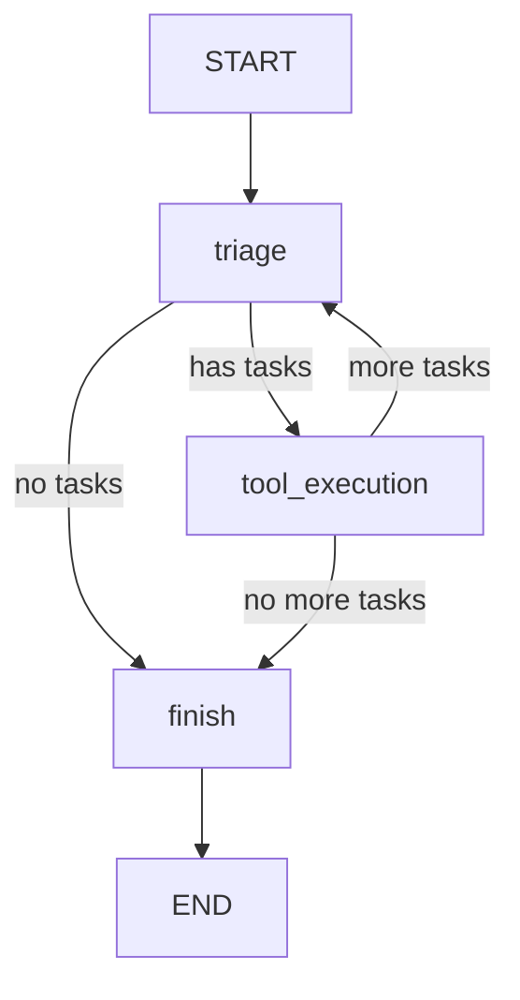

# LangGraph Workflow: `build_graph()` Function Documentation

This document explains the `build_graph()` function in `main.py`, which constructs the LangGraph workflow for the multi-agent task management system.

## Table of Contents

- [Function Overview](#function-overview)
- [Step-by-Step Explanation](#step-by-step-explanation)
  - [1. Initialize StateGraph](#1-initialize-stategraph)
  - [2. Add Nodes to the Graph](#2-add-nodes-to-the-graph)
  - [3. Set Entry Point](#3-set-entry-point)
  - [4. Add Conditional Edges from Triage](#4-add-conditional-edges-from-triage)
  - [5. Add Conditional Edges from Tool Execution](#5-add-conditional-edges-from-tool-execution)
  - [6. Add Final Edge](#6-add-final-edge)
  - [7. Compile and Return Graph](#7-compile-and-return-graph)
- [Visual Workflow Representation](#visual-workflow-representation)
- [Key LangGraph Concepts Used](#key-langgraph-concepts-used)
- [Execution Flow](#execution-flow)
- [Source Code Reference](#source-code-reference)

## Function Overview

```python
def build_graph():
    """Construct the LangGraph workflow"""
```

The `build_graph()` function creates a stateful, multi-agent workflow using LangGraph's `StateGraph` class. This graph orchestrates the flow between different agents and tools in the personal task management system.

## Step-by-Step Explanation

### 1. Initialize StateGraph

```python
workflow = StateGraph(AgentState)
```

- Creates a new `StateGraph` instance with `AgentState` as the state schema
- `AgentState` is a `TypedDict` defined in the code that specifies the structure of data passed between nodes:
  ```python
  class AgentState(TypedDict):
      user_request: str
      task_queue: List[Dict[str, str]]
      results: Dict[str, str]
      current_task: Dict[str, str]
      iteration: int
      agent_thoughts: List[str]
      llm_reasoning: List[str]
  ```
- This follows the LangGraph pattern where the state schema defines what data flows through the graph

### 2. Add Nodes to the Graph

```python
workflow.add_node("triage", triage_node)
workflow.add_node("tool_execution", tool_execution_node)
workflow.add_node("finish", finish_node)
```

The graph contains three main nodes:

- **`triage` node**: Uses the `triage_node()` function to analyze user requests and identify tasks using LLM
  - Analyzes the user's request using the LLM triage agent
  - Identifies discrete tasks and their appropriate tools
  - Populates the `task_queue` with identified tasks
  - Stores LLM reasoning in `llm_reasoning`

- **`tool_execution` node**: Uses the `tool_execution_node()` function to execute specific tools
  - Takes the first task from `task_queue`
  - Executes the appropriate tool (reminder, drafting, or search)
  - Stores results in the `results` dictionary
  - Removes completed task from queue

- **`finish` node**: Uses the `finish_node()` function to compile final results
  - Displays completion message
  - Prepares for final summary display

Each node is a function that takes the current state and returns an updated state.

### 3. Set Entry Point

```python
workflow.set_entry_point("triage")
```

- Defines `triage` as the starting point of the workflow
- When the graph is executed, it begins with the triage node
- This is equivalent to `START -> "triage"` in other LangGraph examples

### 4. Add Conditional Edges from Triage

```python
workflow.add_conditional_edges(
    "triage",
    route_after_triage,
    {
        "tool_execution": "tool_execution",
        "finish": "finish"
    }
)
```

- **Conditional routing**: Uses the `route_after_triage()` function to determine the next step
- **Routing logic**:
  ```python
  def route_after_triage(state: AgentState) -> str:
      if state["task_queue"]:
          return "tool_execution"
      return "finish"
  ```
- **Decision criteria**: If tasks are identified (`task_queue` is not empty), route to `tool_execution`
- **Empty queue handling**: If no tasks are identified, route directly to `finish`
- This follows the LangGraph pattern for dynamic routing based on state

### 5. Add Conditional Edges from Tool Execution

```python
workflow.add_conditional_edges(
    "tool_execution",
    route_after_tool,
    {
        "triage": "triage",
        "finish": "finish"
    }
)
```

- **Conditional routing**: Uses the `route_after_tool()` function to determine the next step
- **Routing logic**:
  ```python
  def route_after_tool(state: AgentState) -> str:
      if state["task_queue"]:
          return "triage"
      return "finish"
  ```
- **Loop creation**: If more tasks remain in queue, route back to `triage` for further analysis
- **Completion handling**: If no tasks remain, route to `finish` to complete the workflow
- This creates a processing loop: `triage -> tool_execution -> triage -> ... -> finish`

### 6. Add Final Edge

```python
workflow.add_edge("finish", END)
```

- Connects the `finish` node to the `END` terminal
- When execution reaches `finish`, the workflow completes
- `END` is a special constant in LangGraph indicating workflow termination

### 7. Compile and Return Graph

```python
return workflow.compile()
```

- Compiles the graph into an executable workflow
- The compilation process:
  - Validates the graph structure
  - Ensures all nodes and edges are properly connected
  - Optimizes the execution path
  - Creates an executable graph object
- Returns the compiled graph ready for execution via `graph.invoke(initial_state)`

## Visual Workflow Representation



## Key LangGraph Concepts Used

1. **StateGraph**: The core class for building stateful workflows
   - Manages the overall workflow structure
   - Handles state passing between nodes
   - Provides compilation and execution capabilities

2. **Nodes**: Individual processing units
   - Each node is a function that processes state
   - Nodes can read and modify the state
   - In this implementation: `triage`, `tool_execution`, `finish`

3. **Conditional Edges**: Dynamic routing based on state
   - Uses routing functions to determine next node
   - Enables complex workflow logic
   - Implemented via `route_after_triage` and `route_after_tool`

4. **Entry Point**: Starting node of the workflow
   - Defined using `set_entry_point("triage")`
   - Equivalent to `START -> "triage"` in other examples

5. **Compilation**: Converts graph definition into executable workflow
   - Validates graph structure
   - Optimizes execution
   - Returns executable graph object

## Execution Flow

1. **Start**: Workflow begins at `triage` node
   - User request is analyzed
   - Tasks are identified using LLM
   - Task queue is populated

2. **Triage**: LLM analyzes request and identifies tasks
   - Uses `LLMTriageAgent` to parse the request
   - Identifies appropriate tools for each task
   - Stores reasoning and task breakdown

3. **Routing Decision**: Conditional routing after triage
   - If tasks exist → route to `tool_execution`
   - If no tasks → route directly to `finish`

4. **Tool Execution**: Executes the first task in queue
   - Takes first task from queue
   - Executes appropriate tool (reminder, drafting, search)
   - Stores results and updates state
   - Removes completed task from queue

5. **Post-Execution Decision**: Conditional routing after tool execution
   - If more tasks remain → route back to `triage`
   - If no more tasks → route to `finish`

6. **Finish**: Compiles results and displays summary
   - Prepares final summary
   - Displays execution tree
   - Shows detailed results table

7. **End**: Workflow completes
   - All tasks processed
   - Results displayed
   - Workflow terminates

## Source Code Reference

The complete implementation can be found in [`main.py`](main.py:159-194):

```python
def build_graph():
    """Construct the LangGraph workflow"""

    workflow = StateGraph(AgentState)

    # Add nodes
    workflow.add_node("triage", triage_node)
    workflow.add_node("tool_execution", tool_execution_node)
    workflow.add_node("finish", finish_node)

    # Set entry point
    workflow.set_entry_point("triage")

    # Add conditional edges
    workflow.add_conditional_edges(
        "triage",
        route_after_triage,
        {
            "tool_execution": "tool_execution",
            "finish": "finish"
        }
    )

    workflow.add_conditional_edges(
        "tool_execution",
        route_after_tool,
        {
            "triage": "triage",
            "finish": "finish"
        }
    )

    # Finish ends the graph
    workflow.add_edge("finish", END)

    return workflow.compile()
```

## Related Documentation

- [LangGraph Official Documentation](https://langchain-ai.github.io/langgraph/)
- [StateGraph API Reference](https://langchain-ai.github.io/langgraph/reference/graph/)
- [Conditional Edges Guide](https://langchain-ai.github.io/langgraph/how-tos/graph-api/)

This implementation follows LangGraph best practices for building resilient, stateful agent workflows with proper error handling and dynamic routing.